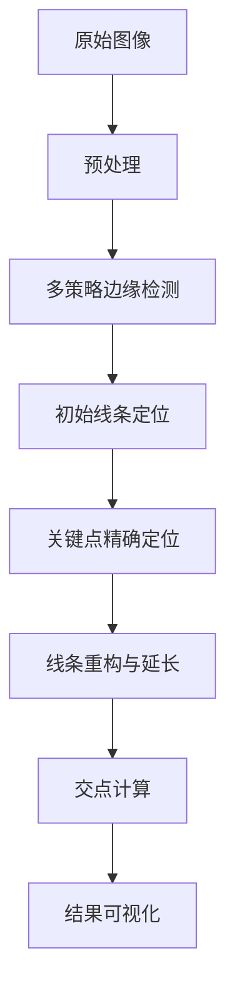

# 图像边缘检测与精确线条定位系统项目文档

## 项目概述

本项目是一个基于OpenCV和Python的图像处理系统，专门用于检测图像中的明暗交界线并精确定位关键边缘。系统通过多阶段处理流程，能够有效识别垂直和水平边缘，计算精确的交点位置，并提供可视化结果。

## 功能特性

- **多策略边缘检测**：结合Sobel梯度、Canny边缘检测和强度变化分析
- **噪音抑制**：智能排除图像边缘区域的干扰噪音
- **精确交点计算**：基于明暗交界点计算线条的精确交点
- **可视化展示**：提供原始图像、边缘检测结果和精确定位结果的可视化对比
- **自适应参数**：根据图像尺寸自动调整处理参数

## 系统架构

### 主要模块

1. **预处理模块**：图像读取、灰度转换和中值滤波
2. **边缘检测模块**：多策略组合的边缘检测算法
3. **关键点定位模块**：在检测到的线条附近寻找明暗交界点
4. **线条重构模块**：基于关键点重构精确线条并计算交点
5. **可视化模块**：结果展示和标注

### 数据处理流程



## 核心算法说明

### 1. 多策略边缘检测算法

```python
def find_optimized_contours(img):
    """
    优化的轮廓线检测算法，结合四种检测策略：
    1. 结构特征验证 - 验证亮到暗的过渡结构
    2. 垂直连续性检测 - 确保边缘的连贯性
    3. 强度变化分析 - 检测明显的明暗变化
    4. 基础边缘统计 - Canny边缘点数量统计
    """
```

### 2. 关键点精确定位算法

```python
def find_edge_points_near_lines(img, left_x, right_x, horizontal_y, search_range=20):
    """
    在已检测线条附近寻找明暗交接处的精确点
    基于梯度强度分析确定最明显的边缘位置
    """
```

### 3. 线条重构与交点计算

```python
def create_refined_visualization(img, original_left, original_right, original_horizontal, 
                               edge_points, edges, gradient_mag):
    """
    基于边缘关键点创建精细化的可视化结果
    包括线条延长、交点计算和标注
    """
```

## 安装与依赖

### 系统要求

- Python 3.7+
- OpenCV 4.2+
- NumPy 1.18+
- Matplotlib 3.2+

### 安装步骤

1. 创建虚拟环境（推荐）：
```bash
python -m venv edge-detection-env
source edge-detection-env/bin/activate  # Linux/Mac
# 或
edge-detection-env\Scripts\activate  # Windows
```

2. 安装依赖包：
```bash
pip install opencv-python numpy matplotlib
```

## 使用方法

### 基本使用

1. 将待处理图像放在项目目录下的`OpenCV_test/`文件夹中
2. 修改代码中的图像路径：
```python
img = cv2.imread('OpenCV_test/your-image.jpg', cv2.IMREAD_GRAYSCALE)
```
3. 运行主程序：
```bash
python edge_detection_system.py
```

### 参数调整

主要可调参数：

```python
# 边缘排除区域大小（根据图像尺寸自动调整）
EDGE_MARGIN = max(120, width // 15)

# Canny边缘检测阈值
edges = cv2.Canny(img, 80, 150)

# 关键点搜索范围
search_range = 25
```

### 输出说明

程序运行后会生成以下输出：

1. **控制台输出**：检测过程中的详细信息和最终结果
2. **可视化窗口**：显示原始图像、边缘检测结果和精确定位结果
3. **交点坐标**：在图像上标注计算得到的精确交点位置

## 性能优化

### 内存优化

- 使用灰度图像处理减少内存占用
- 适时释放不再需要的大型数组
- 使用NumPy高效数组操作

### 计算优化

- 限制搜索范围，避免全图像扫描
- 使用窗口平均减少噪音干扰
- 采用多阶段处理，逐步精细化

### 精度优化

- 结合多种边缘检测策略提高可靠性
- 使用梯度强度分析确定关键点
- 基于几何计算精确交点位置

## 应用场景

1. **工业检测**：产品尺寸测量和定位
2. **建筑测量**：墙面、地面平整度检测
3. **文档处理**：表格线检测和提取
4. **机器人视觉**：环境感知和导航辅助

## 扩展与定制

### 添加新的检测策略

可以继承或修改`find_optimized_contours`函数，添加新的边缘检测策略：

```python
# 示例：添加霍夫变换检测
lines = cv2.HoughLinesP(edges, 1, np.pi/180, threshold=50, minLineLength=100, maxLineGap=10)
```

### 支持其他图像格式

修改图像读取和处理部分以支持其他图像格式：

```python
# 支持透明PNG图像
img = cv2.imread('image.png', cv2.IMREAD_UNCHANGED)
if img.shape[2] == 4:  # 带有alpha通道
    img = cv2.cvtColor(img, cv2.COLOR_BGRA2GRAY)
else:
    img = cv2.cvtColor(img, cv2.COLOR_BGR2GRAY)
```

### 批量处理支持

添加循环处理支持批量图像处理：

```python
import os

image_folder = 'OpenCV_test/'
output_folder = 'results/'

for filename in os.listdir(image_folder):
    if filename.endswith(('.jpg', '.png', '.jpeg')):
        img_path = os.path.join(image_folder, filename)
        # 处理图像...
        # 保存结果...
```

## 故障排除

### 常见问题

1. **图像无法读取**：检查文件路径和格式支持
2. **内存不足**：减小图像尺寸或增加系统内存
3. **检测效果不佳**：调整边缘检测参数和阈值
4. **交点计算错误**：检查关键点定位准确性

### 调试模式

启用详细调试信息：

```python
# 在函数开始时设置
DEBUG_MODE = True

def find_optimized_contours(img):
    if DEBUG_MODE:
        print(f"图像尺寸: {img.shape}")
        # 更多调试信息...
```

## 未来改进方向

1. **深度学习集成**：使用神经网络提高边缘检测精度
2. **实时处理**：优化算法支持视频流实时处理
3. **3D重建**：扩展至三维空间测量和重建
4. **跨平台支持**：开发Web和移动端应用
5. **自动化参数调整**：基于图像内容自动优化处理参数

## 贡献指南

欢迎提交Issue和Pull Request来改进本项目。请确保：

1. 遵循现有的代码风格
2. 添加适当的注释和文档
3. 测试代码的正确性和性能
4. 更新本项目文档

## 许可证

本项目采用MIT许可证，详见LICENSE文件。

## 联系方式

如有问题或建议，请联系：

- 项目维护者：Zhao Chowan
- 邮箱：biubiubiu2000@outlook.com
- 项目地址：https://github.com/your-username/edge-detection-system

---

*文档最后更新日期：2025年9月18日*